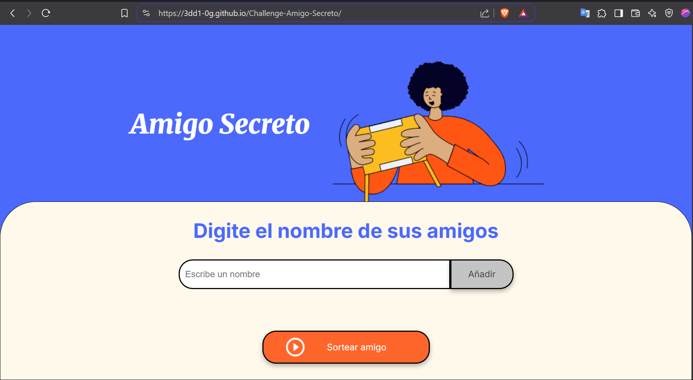

# Amigo Secreto

## Descripción

**Amigo Secreto** es una aplicación web sencilla y fácil de usar que permite a los usuarios agregar nombres de amigos en una lista mediante un formulario y, con solo un clic, seleccionar aleatoriamente un "Amigo Secreto". La aplicación no requiere autenticación ni registro, por lo que es completamente accesible para todos.

## Características

* **Formulario para agregar nombres** : Los usuarios pueden ingresar los nombres de sus amigos que participarán en el juego.
* **Generación aleatoria de "Amigos Secretos"** : Una vez que los nombres están en la lista, se puede hacer clic en un botón para sortear aleatoriamente un "Amigo Secreto" .
* **Interfaz sencilla y amigable** : Diseño fácil de usar, sin complicaciones. Ideal para cualquier persona, independientemente de sus conocimientos técnicos.
* **No requiere autenticación** : Los usuarios pueden comenzar a usar la aplicación inmediatamente sin necesidad de registrarse ni iniciar sesión.

## Tecnologías Utilizadas

* **HTML5** : Estructura y contenido de la página de la página web.
* **CSS3** : Estilos y diseño visual de la pagina web
* **JavaScript** : Lógica de la aplicación y Funcionalidad como agregar amigos, mostrar la lista y realizar el sorteo.

## Instalación

1. Clona este repositorio en tu máquina local:

   ```
   git clone https://github.com/3dd1-0G/Challenge-Amigo-Secreto.git
   ```

## Instrucciones de Uso

1. Puedes acceder a la siguiente url: [https://3dd1-0g.github.io/Challenge-Amigo-Secreto/ ]()para probar la aplicacion web. Si prefieres clonar el repositorio, dentro de la carpeta del repositorio clonado, abre el archivo Index.html usando tu navegador web.

   
2. En el formulario que aparece en la página principal, escribe el nombre de un amigo y pulsa el boton "Añadir", repite esta accion las veces que sean necesarias
3. Haz clic en el botón "Sortear Amigo" para seleccionar a un amigo aleatoriamente.
4. ¡Listo!
